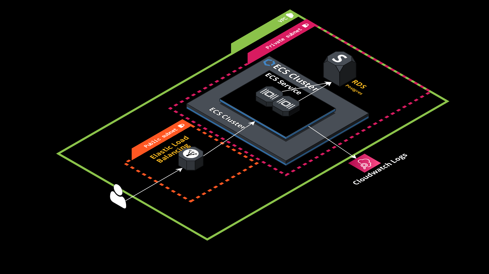

# Hello Birthday API
### DevOps interview task

API is written in Python using [FastAPI](https://fastapi.tiangolo.com/).  
Key features of using FastAPI:  
- Fast: Very high performance, on par with NodeJS and Go (thanks to Starlette and Pydantic). One of the fastest Python frameworks available.
- Fast to code: Increase the speed to develop features by about 200% to 300%. *
- Fewer bugs: Reduce about 40% of human (developer) induced errors. *
- Intuitive: Great editor support. Completion everywhere. Less time debugging.
- Easy: Designed to be easy to use and learn. Less time reading docs.
- Short: Minimize code duplication. Multiple features from each parameter declaration. Fewer bugs.
- Robust: Get production-ready code. With automatic interactive documentation.
- Standards-based: Based on (and fully compatible with) the open standards for APIs: OpenAPI (previously known as Swagger) and JSON Schema.


### Getting started
To run API locally you need to install requirements and start the API.  
I recommend creating virtualenv and execute python within it.
```
python -m venv .venv
source .venv/bin/activate
```
Install requirements
```
pip install requirements.txt
```
Start a local postgresql server in Docker
```
docker run -e POSTGRES_USER=postgresUser -e POSTGRES_PASSWORD=postgresPW -e POSTGRES_DB=postgresDB -d -p 5432:5432 --rm postgres
```
### Start the API
Locally within the virtualenv
```
uvicorn hello_birthday.main:app --host 0.0.0.0 --port 8000
```

Access the API
### Docker setup
Build the image
```
docker build --name happy_birthday_api .
```
Start the API
```
docker run --name happy_birthday_api -p 80:80 happy_birthday_api
```

## AWS (Terraform)
1. Export `AWS_ACCESS_KEY_ID` and `AWS_SECRET_ACCESS_KEY` environment variables.  
2. Inside `terraform` folder execute init and apply
```
terraform init
terraform apply
```
**Terraform will create VPC, Security groups, RDS Postgres instance, ECS cluster and will deploy the app using Fargate, serving through ALB.**  
Minimum disruption budget is set to 50% with 2 initial containers running which means that on new deployment there will be always an available contaner running, allowing to have no-downtime deployments of new app versions.  
**At the end of the "apply" process terraform will output the public DNS of the created ALB to access the API.**
## OpenAPI Docs
To access docs of the API add the `/docs` path to the API endpoint.
Example:
http://hello-birthday-api-859488430.eu-west-1.elb.amazonaws.com/docs

## AWS Diagram

[Additionally link to the blueprint](https://app.cloudcraft.co/view/2a10e6f1-5666-42f2-aec7-6eda91e160c8?key=c8e5417a-91f0-476b-bf58-272a2e304d9e&interactive=true&embed=true)